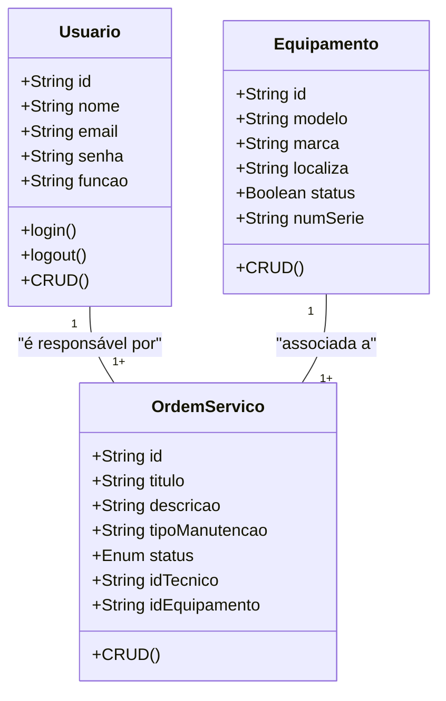

# Sistema de Gestão de Manutenção (SGM) - Formativa

## Briefing
O projeto consiste no desenvolvimento de um Sistema de Gestão de Manutenção (SGM) no formato de uma aplicação web. O objetivo é centralizar e otimizar o controle das atividades de manutenção de máquinas e equipamentos de uma empresa. A plataforma permitirá o cadastro de equipamentos, agendamento de manutenções preventivas e corretivas, e o gerenciamento de ordens de serviço.

## Objetivo do Projeto
- gerenciar informações sobre equipamentos e manutenções realizadas pela empresa
- realizar abertura de chamados de manutenção (ordens de serviço)
- dashboard de histórico de manutenção
- proteger acesso aos dados do sistema (criptografia e autenticação segura de usuários)

## Público-Alvo
- técnicos de manutenção (usuários finais)
- gestores de manutenção (usuários intermediários)
- administradores do sistema (gerenciar a permissão dos usuários)

## Levantamento de Requisitos do Projeto
- ### Requisitos Funcionais

- ### Requisitos Não Funcionais

## Recursos do Projeto
- ### Tecnológicos
    - Framework de Desenvolvimento Next/React
    - Linguagem de Programação TypeScript
    - Banco de Dados: Não Relacional (MongoDB)
    - GitHub
    - VsCode
    - Figma
- ### Pessoal
    - Dev Tudo

## Análise de Risco

## Diagramas

1. ### Classe
Descrever o comportamento das Entidades de um projeto
    
    -Usuários (User/Usuario)
        - Atributos: id, nome, email, senha, função
        - Métodos: create, read, update, delete, login, logout

    - Equipamento (Equipment/Equipamento)
        - Atributos: id, modelo, marca, localiza, status, numeroSerie
        -Métodos: CRUD

    - Ordem de Serviço (OrdemServico)
        - Atributos: id, titulo, descricao, tipoManutencao, status, idTecnico, idEquipamento 


2. ### Casos de Uso
Ilustra as interações dos direferntes tipos de usários (Atores)
com as funcionalidades do sistema

- Caso de Uso:
    - Técnico: Gerenciar Ordes de Serviço (CRUD) e acessar o Dashboard
    - Gerente: funções do técnico + gerenciamento de Equipamentos (CRUD);
    - Admin: Gerenciar Usuários do Sistema, acessar o Dashboard

    Fazer o login -> Antes de Qualquer Ação 

    ```mermaid

    graph TD

        subgraph "SGM"
            caso1([Fazer Login])
            caso2([Gerenciar Ordens de Serviço - CRUD])
            caso3([Gerenciar Equipamentos - CRUD])
            caso4([Gerenciar Usuários])
            caso5([Acessar o DashBoard])
        end

        Tecnico([Técnico de Manutenção])
        Gerente([Gerente de Manutenção])
        Admin([Administrador do Sistema])

        Tecnico --> caso1
        Tecnico --> caso3
        Tecnico --> caso5

        Gerente --> caso1
        Gerente --> caso2
        Gerente --> caso3
        Gerente --> caso5

        Admin --> caso1
        Admin --> caso4
        Admin --> caso5

        caso1 -.-> caso2
        caso1 -.-> caso3
        caso1 -.-> caso4
        caso1 -.-> caso5
    
    ```